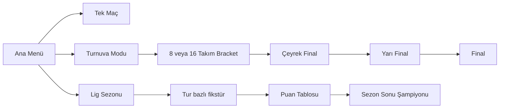
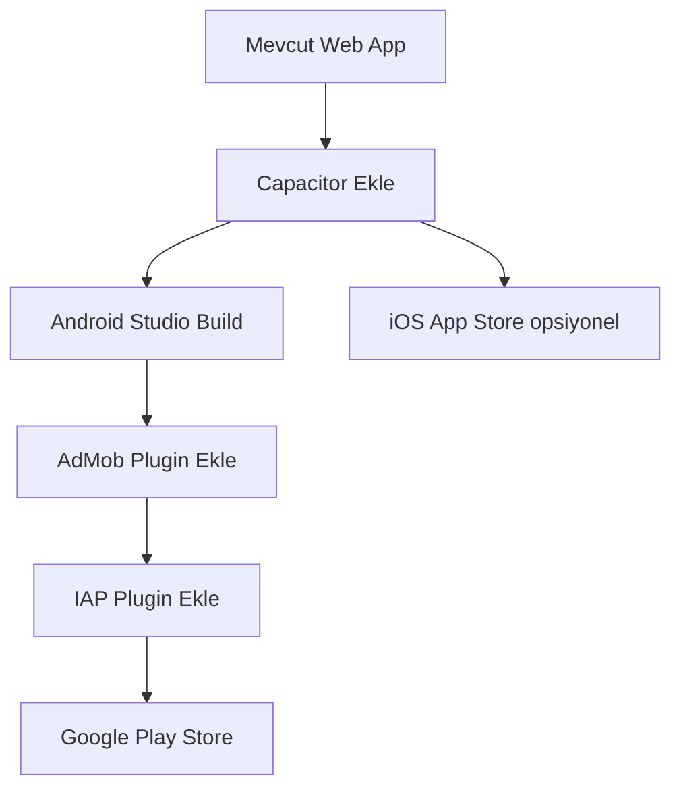

# 🏟️ ChronoBall — Büyüme, Geliştirme & Monetizasyon Planı

## 📋 Mevcut Durum Analizi

### Güçlü Yönler
- **Sıfır runtime dependency** — Vite + Vanilla JS, son derece hafif
- **Benzersiz mekanik** — Kronometreye dayalı 3-çekim sistemi bağımlılık yaratıyor
- **Temiz mimari** — state / engine / ui / utils katmanları iyi ayrılmış
- **Docker + Nginx** — deploy'a hazır
- **Pozisyon & taktik sistemi** — K/D/OS/F rolleri ve attack/balance/defense taktik çarpanları
- **Preset takımlar** — Galatasaray, Fenerbahçe, Beşiktaş, Arsenal, Man City, Man United
- **Web Audio API** — Ses altyapısı hazır
- **localStorage** — Maç geçmişi saklama mevcut

### Zayıf Yönler / Eksikler
- Lig/turnuva modu yok — tek maç sonrası oyun bitiyor
- Oyuncu istatistik geçmişi yok (kim kaç gol attı tarihsel olarak)
- PWA manifest yok — "Uygulamaya Ekle" desteği eksik
- Sosyal paylaşım yok — maç sonucu kartı üretilemıyor
- Sadece 6 preset takım — içerik yetersiz
- Uzatma devresi yok — beraberlik direkt penaltıya gidiyor
- Sadece Türkçe — uluslararası kitle yok
- Leaderboard / başarım sistemi yok
- Multiplayer yok (aynı cihaz 2 kişi bile)
- Reklam / gelir altyapısı hiç yok

---

## 🚀 Geliştirme Öncelikleri (Faz Bazlı)

### FAZ 1 — Temel İçerik & UX (Önce bunlar)

```
[ ] 1.1  PWA Desteği
         - manifest.json + service worker ekle
         - "Ana Ekrana Ekle" butonu göster
         - Offline oyun desteği (zaten client-side, sadece cache lazım)

[ ] 1.2  Sosyal Paylaşım Kartı
         - Maç sonu ekranında "Sonucu Paylaş" butonu
         - Canvas API ile görsel kart üret (takım adları, skor, MOTM)
         - navigator.share() ile native share sheet aç

[ ] 1.3  Uzatma Devresi
         - Berabere bitince 90-105. dakika eklenir
         - İki yarı şeklinde (90-97, 97-105) oynanır
         - Hala berabere → penaltı atışları

[ ] 1.4  Daha Fazla Preset Takım (30+ hedef)
         - Avrupa ligleri: Real Madrid, Barcelona, PSG, Bayern, Juventus
         - Türkiye: Trabzonspor, Başakşehir, Kayserispor
         - Milli takımlar: Türkiye, Almanya, Brezilya, Arjantin

[ ] 1.5  Yerel Liderlik Tablosu
         - localStorage'da "en fazla gol" "en az yenilen" gibi istatistikler
         - Ekran içi "Rekortmenler" sekmesi
```

### FAZ 2 — Lig & Turnuva Sistemi



```
[ ] 2.1  Turnuva Modu
         - 4 / 8 / 16 takım kupa bracketi
         - Çift eleme veya tek eleme seçeneği
         - Turnuva sonucu kayıt

[ ] 2.2  Lig Sezonu
         - 4-8 takım lig, çift devre fikstür
         - Galibiyet 3p, beraberlik 1p, yenilgi 0p
         - Puan tablosu ekranı
         - Gol krallığı

[ ] 2.3  Kalıcı Oyuncu Profilleri
         - Takım başına tarihsel gol/kart istatistikleri
         - "En İyi 11" özelliği
```

### FAZ 3 — Multiplayer & Sosyal

```
[ ] 3.1  Aynı Cihazda 2 Kişi (Pass & Play)
         - Her tur sırasında cihazı diğerine verme mekaniklği
         - Kazanan olmadan sıra geçmez

[ ] 3.2  Online Multiplayer (WebSocket / Supabase Realtime)
         - Oda kodu ile arkadaşa davet
         - Sıra tabanlı ağ protokolü (çok basit, sadece digit gönderimi)
         - Supabase ücretsiz tier yeterli başlangıç için

[ ] 3.3  Global Liderlik Tablosu
         - Supabase veya Firebase Realtime DB
         - Haftalık en fazla gol atan oyuncu
```

---

## 💰 Monetizasyon Stratejileri

### Strateji 1 — Freemium Model (Web + Mobil)

| İçerik | Ücretsiz | Premium |
|--------|----------|---------|
| Preset Takım Sayısı | 6 | 50+ |
| Maç Geçmişi | 20 maç | Sınırsız |
| Turnuva Modu | ❌ | ✅ |
| Lig Sezonu | ❌ | ✅ |
| Reklam | Var | Yok |
| Tema / Skin | 1 | 5+ |
| İstatistik Analizi | Temel | Detaylı |

**Premium Fiyatlandırma:**
- Tek seferlik "ChronoBall Pro": ~₺49 / $1.99
- Ya da yıllık abonelik: ₺79 / $2.99

### Strateji 2 — Reklam Geliri (Web)

```
[ ] Google AdSense entegrasyonu
    - Maç konfigürasyon ekranında banner (320x50)
    - Halftime ekranında interstitial (kullanıcı geçiş anında)
    - Fulltime ekranında banner
    Tahmini: 1000 kullanıcı/gün → ~$3-10/gün
```

### Strateji 3 — Android Uygulama (AdMob)

```
[ ] Google AdMob entegrasyonu
    - Banner reklam: maç ekranı altında sabit
    - Interstitial: maç sonu ekranında göster
    - Rewarded Video: "Ekstra tur hakkı" veya "Özel takım kilidi aç"
    Tahmini: 10.000 kullanıcı/gün → ~$20-80/gün
```

### Strateji 4 — In-App Purchase Paketleri

```
Paket 1 — "Dünya Yıldızları"        ₺29 / $0.99
  - 20 Avrupa kulübü preset (Real, Barça, PSG, Bayern...)

Paket 2 — "Kupa Şampiyonu"          ₺49 / $1.99
  - Turnuva + Lig modu kilidi açar

Paket 3 — "Stat Analisti"           ₺39 / $1.49
  - Tarihsel istatistikler, oyuncu trendi, kariyer modu

Paket 4 — "Reklamsız Deneyim"       ₺69 / $2.99
  - Tüm reklamlar kalkar (tek seferlik)

Bundle — "ChronoBall Tam Paket"     ₺119 / $4.99
  - Yukarıdaki her şey dahil
```

### Strateji 5 — Sponsorluk & Ortaklık

```
- Türk spor giyim markaları (Kinetix, Lescon) — preset forma renk sponsorluğu
- Futbol analiz uygulamaları cross-promotion
- Türk futbol taraftar grupları ile influencer anlaşması
```

---

## 📱 Android Uygulama Yol Haritası

### Seçenek A — Capacitor (Önerilen ⭐)



**Neden Capacitor?**
- Mevcut Vite + Vanilla JS kodunu sıfır değişiklik ile sarar
- Native API'ler: AdMob, bildirimler, share, haptic feedback
- Tek codebase → Android + iOS
- Ionic/Capacitor topluluğu büyük

**Kurulum Adımları:**
```bash
npm install @capacitor/core @capacitor/cli
npx cap init ChronoBall com.chronoball.app
npm install @capacitor/android
npx cap add android
npm run build
npx cap sync
npx cap open android   # Android Studio açılır
```

**Gerekli Capacitor Pluginleri:**
```bash
npm install @capacitor-community/admob     # Reklam
npm install @capacitor/share               # Paylaşım
npm install @capacitor/haptics             # Titreşim geri bildirim
npm install @capacitor/status-bar          # Durum çubuğu
npm install capacitor-purchases            # In-App Purchase (RevenueCat)
```

### Seçenek B — TWA (Trusted Web Activity)

```
- Chrome Custom Tab'ı native uygulama gibi paketler
- Minimum iş gücü ama native API erişimi yok
- AdMob entegre edilemez
- Sadece Play Store'da listeleme için uygun
- Bubblewrap CLI ile 1 günde yapılır
```

### Seçenek C — React Native / Flutter Yeniden Yazım

```
- En iyi performans ama en yüksek maliyet
- Oyun mekaniği basit olduğu için gereksiz
- Sadece çok büyük kullanıcı tabanı hedefliyorsa değerli
- Şu an için: HAYIR
```

**Karar: Capacitor ile gidin.**

---

## 📊 Gelir Modeli Projeksiyon (Ayda)

| Kanal | Senaryo: Düşük | Senaryo: Orta | Senaryo: Yüksek |
|-------|---------------|--------------|----------------|
| AdSense (Web) | $30 | $150 | $500 |
| AdMob (Android) | $50 | $300 | $1500 |
| IAP Satışları | $20 | $200 | $1000 |
| Premium Sub | $10 | $100 | $500 |
| **Toplam** | **$110** | **$750** | **$3500** |

---

## 🗺️ Öncelik Sırasına Göre Uygulama Planı

```
SPRINT 1 (1-2 hafta) — Hızlı Kazanımlar
  ✅ PWA manifest + service worker
  ✅ Sosyal paylaşım kartı (Canvas)
  ✅ Uzatma devresi
  ✅ 15+ yeni preset takım ekle
  ✅ Yerel liderlik tablosu

SPRINT 2 (2-3 hafta) — Capacitor Android
  ✅ Capacitor kurulumu
  ✅ AdMob banner + interstitial
  ✅ Google Play store listing
  ✅ Haptic feedback

SPRINT 3 (3-4 hafta) — Monetizasyon Sistemi
  ✅ Freemium kilitli içerik mantığı
  ✅ In-App Purchase (RevenueCat)
  ✅ Premium takım paketleri

SPRINT 4 (4-6 hafta) — Lig & Turnuva
  ✅ Turnuva modu (8 takım)
  ✅ Lig sezonu
  ✅ Sezon istatistikleri ekranı

SPRINT 5 (6-10 hafta) — Sosyal & Multiplayer
  ✅ Pass & Play (2 kişi aynı cihaz)
  ✅ Online oda sistemi (Supabase)
  ✅ Global liderlik tablosu
```

---

## 🎯 Hızlı Kazanım: PWA Manifest (1 saat iş)

[`manifest.json`](src/manifest.json) dosyası eklenecek:
```json
{
  "name": "ChronoBall",
  "short_name": "ChronoBall",
  "description": "Kronometreye dayalı futbol simülasyonu",
  "start_url": "/",
  "display": "standalone",
  "background_color": "#0f0f0f",
  "theme_color": "#00ff88",
  "icons": [...]
}
```

Bu tek değişiklik ile mobil kullanıcılar "Ana Ekrana Ekle" diyebilir — AdMob'suz "uygulama" hissi verir.

---

## 🔑 Kritik Teknik Kararlar

1. **State yönetimi genişletilmeli** — Lig/turnuva için [`gameState.js`](src/state/gameState.js) `season` ve `tournament` objeleri almalı
2. **Router eklenmeli** — SPA routing (hash-based) eklenirse deep link ve PWA navigation düzelir
3. **Canvas paylaşım kartı** — [`resultScreens.js`](src/ui/resultScreens.js) içine `buildShareCard()` fonksiyonu eklenecek
4. **Capacitor build** — [`vite.config.js`](vite.config.js) Capacitor ile uyumlu, değişiklik gerekmez
5. **IAP mantığı** — `src/store/purchases.js` yeni dosyası, tüm kilit/kilit-açma mantığını merkezler
