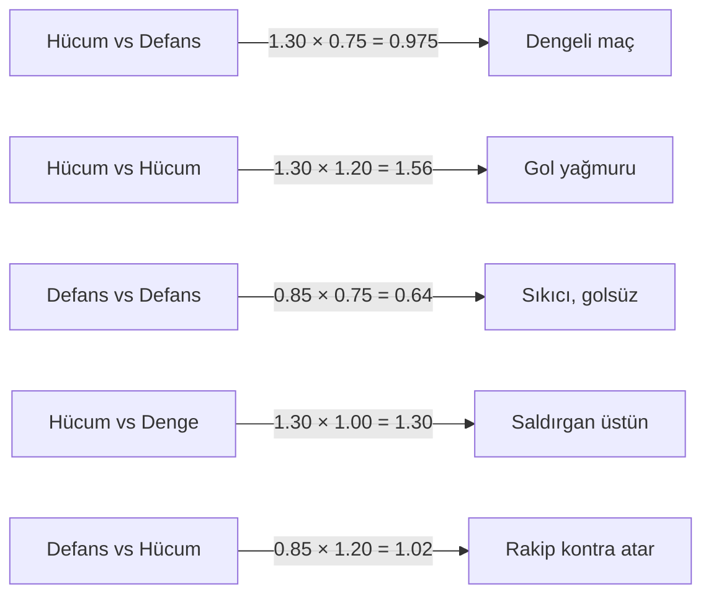

# 🔧 ChronoBall — Core Mekanik Geliştirme Teknik Planı

## 📍 Mevcut Sorunların Kök Neden Analizi

### Sorun 1: Taktik Sistemi Tek Yönlü

[`actions.js:34`](src/engine/actions.js:34) satırındaki `TACTIC_MODS`:
```js
export const TACTIC_MODS = {
  attack:  1.3,
  balance: 1.0,
  defense: 0.7,  // BUG: Kendi gol şansını düşürüyor, rakibin değil!
}
```

[`match.js:90`](src/engine/match.js:90) satırında taktik sadece SALDIRAN takımdan alınıyor:
```js
const tactic = state.tactics[teamIdx] || 'balance'  // teamIdx = saldıran
```

**Sonuç:** Defans taktiği seçen takım kendi gol şansını düşürür ama rakibin gol şansı üzerinde sıfır etkisi var. Defans taktiği oynamak aktif dezavantaj!

### Sorun 2: Pozisyon Asimetrisi

[`actions.js:20-25`](src/engine/actions.js:20) POS_WEIGHTS:
```js
K:  { goalMult: 0.15 }  // Kaleci saldırırsa kötü
F:  { goalMult: 0.80 }  // Forvet saldırırsa iyi
```

Ama SAVUNMA hesabı hiç yok. Rakibin forvet sayısı, senin kalecin, defans oyuncuların — hiçbiri rakibin gol şansını etkilemiyor. 10 forvet kadrosu = 10 kaleci kadrosu kadar savunma yapıyor.

### Sorun 3: Atmosfer Tekdüze

[`match.js:236`](src/engine/match.js:236): Her gol için aynı metin:
```js
showAction(`⚽ ${label} GOL!`, `${currentMinute}. dakika`, 'gol', true, pLabel)
```
Her miss için:
```js
showAction(`${icon} Gol Yok`, `${digit} geldi — ${currentMinute}. dakika`, ...)
```
Hiç varyasyon yok, maç logu kuru.

---

## 🏗️ Geliştirme 1: Bilateral Taktik Sistemi

### Tasarım

Her taktik artık hem saldırı hem savunma modifiyeri olacak.

```
SALDIRAN TAKTİK (kendi gol şansını etkiler)
  attack:  +30%  → Agresif baskı, gol fırsatları artar
  balance: ±0%   → Normal
  defense: -15%  → Temkinli, az gol şansı üretir

SAVUNAN TAKTİK (rakibin gol şansını etkiler)
  attack:  +20%  → Yüksek hat, arkada boşluklar var → rakip kolay gol atar
  balance: ±0%   → Normal
  defense: -25%  → Kompakt blok, rakip zor gol atar
```

### Taktik Senaryoları (Görsel)



### Değişiklik: `src/engine/actions.js`

**Mevcut** `TACTIC_MODS` kaldırılır, yerine:

```js
// Saldıran takımın taktiği → kendi gol üretim şansı
export const ATTACK_TACTIC_MODS = {
  attack:  1.30,
  balance: 1.00,
  defense: 0.85,
}

// Savunan takımın taktiği → rakibin gol şansına etkisi
export const DEFENSE_TACTIC_MODS = {
  attack:  1.20,  // Yüksek hat = arkada boşluk = rakip kolay gol
  balance: 1.00,
  defense: 0.75,  // Kompakt = rakip zor gol
}
```

Tüm `calc*` fonksiyonları yeni imza alır:
```js
// Eski: calcGoalMult(pos, tactic)
// Yeni: calcGoalMult(pos, atkTactic, defTactic)
export function calcGoalMult(pos, atkTactic, defTactic) {
  const base   = POS_WEIGHTS[pos]?.goalMult ?? 0.5
  const atkMod = ATTACK_TACTIC_MODS[atkTactic] ?? 1.0
  const defMod = DEFENSE_TACTIC_MODS[defTactic] ?? 1.0
  return Math.min(0.95, base * atkMod * defMod)
}
```

Aynı pattern tüm fonksiyonlara uygulanır:
- [`calcFreekickNearMult`](src/engine/actions.js:48)
- [`calcFreekickFarMult`](src/engine/actions.js:56)
- [`calcPenaltyMult`](src/engine/actions.js:64) — penalty için defMod hafifçe uygulanır (0.5 ağırlık)

### Değişiklik: `src/engine/match.js`

[`_processAction`](src/engine/match.js:83) ve [`_processThird`](src/engine/match.js:193) fonksiyonlarına `defTactic` eklenir:

```js
// Eski
const tactic = state.tactics[teamIdx] || 'balance'

// Yeni
const atkTactic = state.tactics[teamIdx]        || 'balance'
const defTactic = state.tactics[1 - teamIdx]    || 'balance'

// Calc çağrısı
const gm = calcGoalMult(selectedPlayer.pos, atkTactic, defTactic)
```

---

## 🏗️ Geliştirme 2: Kadro Kompozisyonu Savunma Etkisi

### Tasarım

Rakibin kadro yapısı, senin gol atma şansını etkiler.

```
Kaleci (K) yok ise:          +25% kolay gol
Her aktif Defans (D) oyuncusu: -4% zor gol (max 4 oyuncu = -16%)
Kırmızı kartlı oyuncular hesaba katılmaz (sahada değil)
```

**Örnek Senaryolar:**
| Rakip Kadro | Etki |
|-------------|------|
| 1K + 4D (ideal) | 1.0 - 0.16 = 0.84 → %16 zor |
| 1K + 0D (tüm OS+F) | 1.0 - 0 = 1.00 → normal |
| 0K + 0D (tüm F!) | 1.0 + 0.25 = 1.25 → %25 kolay |
| 1K + 2D (kırmızı kartlı) | hesap dinamik güncellenir |

**Tradeoff yaratılıyor:** 10 forvet = rakip sana kolay gol atar.

### Yeni Fonksiyon: `src/engine/actions.js`

```js
/**
 * Savunma kalite çarpanı (rakibin gol ŞANSINı etkiler)
 * Düşük değer = zor gol atmak
 * Yüksek değer = kolay gol atmak
 */
export function calcDefenseQualityMod(team) {
  const active    = team.players.filter(p => !p.redCard)
  const hasKeeper = active.some(p => p.pos === 'K')
  const defCount  = active.filter(p => p.pos === 'D').length

  let mod = 1.0
  if (!hasKeeper) mod += 0.25          // Kaleci yok: +25%
  mod -= Math.min(4, defCount) * 0.04  // Her defans: -4% (max 4 tanesi sayılır)

  return Math.max(0.55, Math.min(1.40, mod))
}
```

### Değişiklik: Calc fonksiyonlarına `defTeam` parametresi eklenir

```js
// Eski: calcGoalMult(pos, atkTactic, defTactic)
// Yeni: calcGoalMult(pos, atkTactic, defTactic, defTeam)
export function calcGoalMult(pos, atkTactic, defTactic, defTeam) {
  const base      = POS_WEIGHTS[pos]?.goalMult ?? 0.5
  const atkMod    = ATTACK_TACTIC_MODS[atkTactic] ?? 1.0
  const defTacMod = DEFENSE_TACTIC_MODS[defTactic] ?? 1.0
  const defQual   = defTeam ? calcDefenseQualityMod(defTeam) : 1.0
  return Math.min(0.95, base * atkMod * defTacMod * defQual)
}
```

### Değişiklik: `src/engine/match.js`

```js
// _processAction ve _processThird içinde:
const defTeamIdx = 1 - teamIdx
const defTactic  = state.tactics[defTeamIdx] || 'balance'
const defTeam    = state.teams[defTeamIdx]

const gm = calcGoalMult(selectedPlayer.pos, atkTactic, defTactic, defTeam)
```

**Penaltı için özel kural:** Penaltıda savunma kalitesi daha az etkili (gerçeğe uygun — penaltıda 1'e 1 kaleci karşısında):
```js
export function calcPenaltyMult(pos, atkTactic, defTactic, defTeam) {
  const base       = POS_WEIGHTS[pos]?.penaltyMult ?? 0.70
  const atkMod     = ATTACK_TACTIC_MODS[atkTactic] ?? 1.0
  const atkModLight = 1 + (atkMod - 1) * 0.3   // Taktik etkisi azaltılmış
  const defQual    = defTeam ? calcDefenseQualityMod(defTeam) : 1.0
  const defQualLight = 1 + (defQual - 1) * 0.4 // Savunma etkisi azaltılmış
  return Math.min(0.95, base * atkModLight * defQualLight)
}
```

### Config Ekranı UI Güncelleme

Kullanıcıya pozisyon tradeoff'u anlatmak için config ekranında küçük bir bilgi notu:

[`src/index.html`](src/index.html) — taktik seçicinin altına:
```html
<div class="tactic-hint">
  🛡️ Defans: rakip az gol atar · ⚔️ Hücum: kendiniz çok gol atarsınız ama yiyebilirsiniz
</div>
```

---

## 🏗️ Geliştirme 3: Futbol Atmosferi

### Yorum Varyasyon Sistemi

[`src/engine/actions.js`](src/engine/actions.js) sonuna eklenir:

```js
// ── Yorumcu Metinleri ────────────────────────────────────────
export const COMMENTARY = {
  goal_direct: [
    'Top fileleri buluyor!',
    'Mükemmel bir bitiriş!',
    'Seyirciler ayağa kalktı!',
    'Kimse durduramadı!',
    'Harika bir gol! Stat sahası inledi!',
  ],
  goal_penalty: [
    'Soğukkanlılıkla köşeye!',
    'Kaleci yanlış tarafa atladı!',
    'Üst köşeden süpür!',
    'Penaltı ustası!',
  ],
  goal_freekick: [
    'Duvarın üzerinden kıvrılarak!',
    'Kale duvarı dağıldı!',
    'İnanılmaz bir kıvrım!',
  ],
  goal_corner: [
    'Saptırmayla içeri!',
    'Kalabalıktan sıyrıldı!',
    'Ön direkten dönerek!',
  ],
  miss_penalty: [
    'Direk! Top dışarı!',
    'Kaleci muhteşem kurtardı!',
    'Penaltı kaçtı, büyük şans!',
    'Kaleci bir hamleyle önledi!',
  ],
  miss_freekick: [
    'Duvar bloke etti!',
    'Kaleci güçlü durdu!',
    'Az fark üstten aştı!',
    'Biraz daha aşağı olsaydı...',
  ],
  miss_corner: [
    'Kimse yetişemedi!',
    'Defans temizledi!',
    'Kaleci hâkim oldu!',
  ],
  card_yellow: [
    'Hakem cebine gitti!',
    'Tartışmalı karar!',
    'İtiraz etse de değişmiyor!',
  ],
  card_red: [
    'Erken duş! Takım 10 kişi!',
    'Maç dengeleri değişti!',
    'Tartışmalı ama karar kesin!',
  ],
  foul: [
    'Sert müdahale!',
    'Hakem hemen düdüğü çaldı!',
    'Rakip yerde kaldı!',
  ],
  offside: [
    'Bayrak kalktı!',
    'Ofsayt tuzağı mükemmel kuruldu!',
    'Çok erken koştu!',
  ],
}

export function pickCommentary(type) {
  const arr = COMMENTARY[type] || []
  if (!arr.length) return ''
  return arr[Math.floor(Math.random() * arr.length)]
}
```

### `src/engine/match.js` Yorumcu Entegrasyonu

Her `showAction` çağrısına yorumcu metni eklenir:

```js
// Eski:
showAction(`⚽ GOL!`, `${currentMinute}. dakika`, 'gol', true, pLabel)

// Yeni:
const commentary = pickCommentary('goal_direct')
showAction(`⚽ GOL!`, `${currentMinute}' — ${commentary}`, 'gol', true, pLabel)
```

**Tüm showAction çağrıları için mapping:**
| Aksiyon | Commentary Key |
|---------|---------------|
| Direkt GOL | `goal_direct` |
| Penaltı GOL | `goal_penalty` |
| Frikik GOL | `goal_freekick` |
| Korner GOL | `goal_corner` |
| Penaltı miss | `miss_penalty` |
| Frikik miss | `miss_freekick` |
| Korner miss | `miss_corner` |
| Sarı Kart | `card_yellow` |
| Kırmızı Kart | `card_red` |
| Faul | `foul` |
| Ofsayt | `offside` |

### Maç Log Güncellemesi

[`src/ui/log.js`](src/ui/log.js) incelenmeli — `addLog` çağrıları yorumcuya göre zenginleştirilecek.

### `src/index.html` Atmosfer İyileştirmeleri

Aksiyon referans tablosundaki metinler daha canlı hale getirilecek:

```html
<!-- Eski -->
<span class="ar-lbl">⚽ GOL!</span>
<!-- Yeni -->
<span class="ar-lbl">⚽ ANİ GOL! 💥</span>
```

Active team pill daha dinamik:
```html
<!-- Eski: "SIRA: <takım>" -->
<!-- Yeni: "⚽ TOPDA: <takım>" -->
```

---

## 📁 Değiştirilecek Dosyalar Özeti

| Dosya | Değişiklik Türü | Önem |
|-------|----------------|------|
| [`src/engine/actions.js`](src/engine/actions.js) | `TACTIC_MODS` → 2 ayrı obje, yeni `calcDefenseQualityMod`, `COMMENTARY` + `pickCommentary` | Kritik |
| [`src/engine/match.js`](src/engine/match.js) | Tüm `calc*` çağrılarına `defTactic` + `defTeam` eklenmesi, yorumcu entegrasyonu | Kritik |
| [`src/index.html`](src/index.html) | Taktik hint metni, aktif takım pill metni | Küçük |

## 🔄 Değişmeyecek Dosyalar

- [`src/state/gameState.js`](src/state/gameState.js) — state yapısı yeterli
- [`src/ui/players.js`](src/ui/players.js) — UI değişmiyor
- [`src/ui/screens.js`](src/ui/screens.js) — değişmiyor
- [`src/utils/storage.js`](src/utils/storage.js) — değişmiyor
- [`src/data/presetTeams.js`](src/data/presetTeams.js) — değişmiyor (pozisyonlar zaten var)

---

## ✅ Uygulama Sırası (Code modunda)

```
1. src/engine/actions.js
   - TACTIC_MODS'u ATTACK_TACTIC_MODS + DEFENSE_TACTIC_MODS'a böl
   - calcDefenseQualityMod() ekle
   - Tüm calc fonksiyonlarının imzasını güncelle
   - COMMENTARY objesi + pickCommentary() ekle

2. src/engine/match.js
   - _processAction(): defTactic + defTeam değişkenleri
   - _processThird(): tüm calc çağrıları güncellenir
   - Tüm showAction çağrılarına yorumcu metni eklenir
   - pickCommentary import edilir

3. src/index.html
   - Taktik hint metni
   - TOPDA etiketi
```
